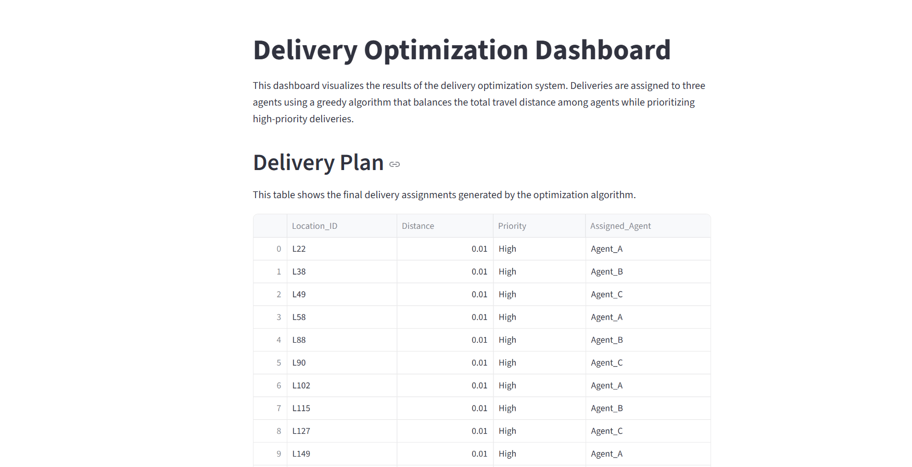
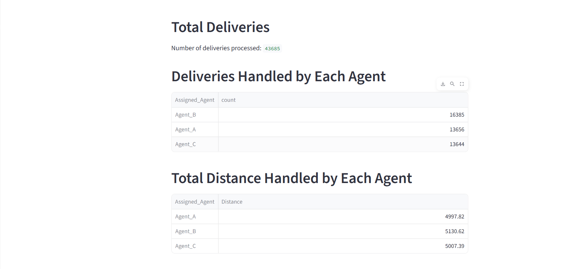
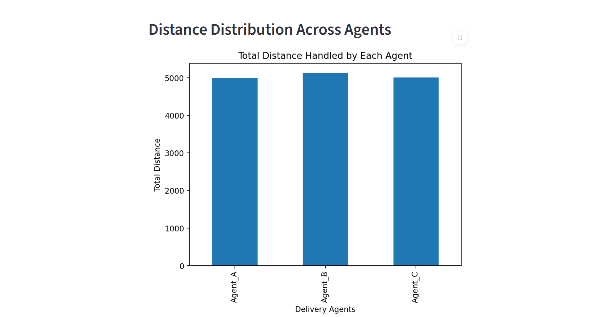
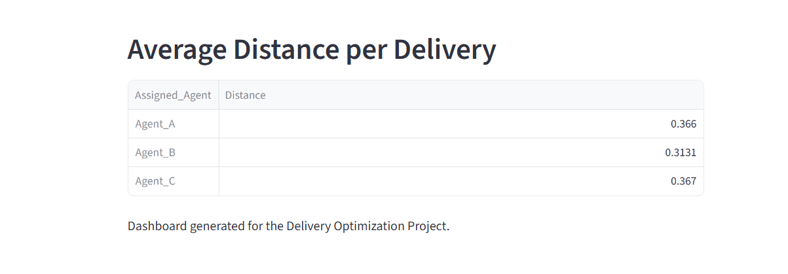

# Delivery Optimization Project

## Introduction

This project focuses on solving a basic logistics problem where delivery tasks must be distributed among multiple delivery agents. The objective is to assign deliveries in such a way that the workload is balanced while also considering delivery priority.

Each delivery has a priority level (High, Medium, or Low) and a distance from the warehouse. The system reads the dataset, organizes deliveries based on priority and distance, and then assigns them to three delivery agents.

The goal is to keep the total travel distance for each agent nearly equal.

## Problem Description

The input to the system is a CSV file that contains the following information:

- Location_ID
- Distance from warehouse
- Delivery Priority (High / Medium / Low)

The program performs the following steps:

1. Read the delivery dataset from a CSV file.
2. Sort deliveries based on priority and distance.
3. Assign deliveries to three delivery agents.
4. Ensure that the total distance covered by each agent is balanced.
5. Generate a final delivery plan showing the assigned agent for each delivery.

## Dataset

The dataset used in this project was taken from Kaggle and then preprocessed to match the required format for the task.

The preprocessing step creates a simplified dataset containing:

- Location_ID
- Distance
- Priority

Distance is calculated using the coordinates of the restaurant and delivery location.

## Project Structure

Delivery-Optimization

src  
  preprocess_dataset.py  
  delivery_optimization.py  

data  
  raw_dataset.csv  
  processed_dataset.csv  

output  
  delivery_plan.csv  

dashboard.py   
README.md  
requirements.txt  

## Approach

To solve this problem, a simple greedy algorithm is used.

The main idea of the algorithm is:

1. Convert priority values into numeric form so they can be sorted.
2. Sort deliveries first by priority and then by distance.
3. Assign each delivery to the agent who currently has the lowest total distance.
4. Update the distance for that agent after each assignment.

This method helps distribute deliveries in a balanced way while still giving priority to more urgent deliveries.

## Why Greedy Algorithm Was Chosen

The Greedy Algorithm was selected for this project because it provides a simple and efficient way to handle delivery assignment problems.

In this scenario, deliveries must be distributed among three agents while keeping the total travel distance balanced. A greedy strategy works well because it makes the best possible decision at each step. Whenever a delivery needs to be assigned, the algorithm chooses the agent who currently has the lowest total distance.

This approach gradually balances the workload across all agents.

Another reason for choosing this algorithm is its simplicity and speed. More complex optimization techniques such as dynamic programming or advanced routing algorithms could also be applied, but they would introduce unnecessary complexity for a problem of this size.

The greedy method is easy to implement, easy to understand, and performs well for this type of scheduling and load‑balancing problem. Because of these reasons, it was considered an appropriate choice for this delivery optimization task.

## Dashboard

A simple dashboard was also created using Streamlit to visualize the results of the optimization process.

The dashboard allows users to view:

- The final delivery plan
- Number of deliveries handled by each agent
- Total distance covered by each agent
- Distribution of delivery distances
- Average delivery distance per agent

This makes it easier to understand how the deliveries are distributed.

## Running the Project

Step 1: Install the required libraries

pip install -r requirements.txt

Step 2: Run the dataset preprocessing script

python src/preprocess_dataset.py

Step 3: Run the delivery optimization program

python src/delivery_optimization.py

Step 4: Launch the dashboard

streamlit run dashboard.py

---

## Output

After running the optimization script, the final delivery assignments will be saved in:

output/delivery_plan.csv

Example:

Location_ID,Distance,Priority,Assigned_Agent  
L1,2.4,High,Agent_A  
L2,3.1,Medium,Agent_B  
L3,4.0,Low,Agent_C  

---

## Conclusion

This project demonstrates how a simple algorithm can be used to distribute delivery tasks efficiently among multiple agents. By prioritizing urgent deliveries and balancing travel distance, the system provides a practical solution for basic logistics planning.

The addition of a dashboard also helps visualize the results and better understand the distribution of work among agents.
